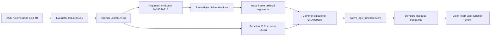

# Рекурсивная трассировка AGE-функций Golden Land 2

## Результат

Нативный oracle и clean-room runtime теперь сравнивают не только итоговые значения AGE-узлов и переходы графа, но также каждый рекурсивный тип узла и фактические вызовы функций: полный ID, слот диспетчера, имя, record, порядок аргументов, значения аргументов и результат.

Scope: `C:/Users/serfe/.agents/skills/work/goldenland-deep-re/scope.md`.

## Воспроизведение

```powershell
i686-w64-mingw32-clang++ tools/native-oracle/oracle.cpp -std=c++17 -O2 -Wall -Wextra -municode -static -o .tmp/native-oracle.exe -lbcrypt -lgdi32

.tmp/native-oracle.exe `
  --game-root E:/Games/zlato22 `
  --asset-root G:/ws/zlato2/public/assets `
  --host-facades --probe-config-object --initialize `
  --quiet-stubs --server-only --invoke-native-dialog

node tools/replay-assets.mjs
node tools/compare-dialogue-traces.mjs `
  tools/demon-age.native.ndjson `
  tools/demon-age.clean-room.ndjson
```

Ожидаемый итог:

```text
Matched 147 AGE evaluations, 84 flow nodes, 6 function calls,
3 packet payloads, and 2 dialogue turns
```

## Evidence

| ID | Наблюдение | Источник |
|---|---|---|
| E-004 | Runtime kind `48` вызывает общий AGE function dispatcher; полный ID передаётся как `float64` из node `+0x40` | `Server.dll:0x1403A153 -> 0x14039888` |
| E-005 | Нативная и clean-room трассы совпали для 147 evaluations, 84 flow nodes и 6 вызовов функций | `tools/demon-age.*.ndjson` |
| E-006 | Браузерный диалог после ответа показывает NPC phrase → hero reply → следующую NPC phrase и два ответа без `pageerror` | браузерная проверка |

Полные evidence-файлы: `C:/Users/serfe/.agents/skills/work/goldenland-deep-re/evidence/`.

## Findings

### F-005 — полный AGE function ID хранится в runtime node `+0x40`

- category: `reverse_algo`
- status: `validated`
- confidence: high
- evidence_ids: `E-004`, `E-005`
- location: `Server.dll:0x1403A153`

Основной evaluator `0x1403A010` диспетчеризует runtime kind `48` в ветку `0x1403A153`. Ветка передаёт в `0x14039888`:

1. `this` AGE program;
2. указатель runtime node;
3. `float64` из node `+0x40`.

Это значение является полным function ID, например:

| Функция | ID | Low-24 dispatch slot |
|---|---:|---:|
| `D_Say` | `0x01000004` | `4` |
| `D_Answer` | `0x01000006` | `6` |

### F-006 — порядок аргументов можно восстановить без повторной оценки

- category: `reverse_algo`
- status: `validated`
- confidence: high
- evidence_ids: `E-004`, `E-005`
- location: `tools/native-oracle/oracle.cpp`

Oracle оборачивает одновременно:

- основной evaluator `Server.dll+0x3A010`;
- argument evaluator `Server.dll+0x3A914`.

Стек trace frames собирает результаты только непосредственных дочерних вычислений. Когда kind-48 node завершается, frame содержит реальные аргументы в нативном порядке выполнения. Повторно вычислять expression nodes не требуется, поэтому трассировка не меняет побочные эффекты.

### F-007 — демонстрационный диалог совпадает на уровне вызовов

- category: `reverse_algo`
- status: `validated`
- confidence: high
- evidence_ids: `E-005`, `E-006`

Совпавшая последовательность:

```text
D_Say(2684)
D_Answer(2686)
D_Answer(2696)
D_Say(2719)
D_Answer(1529)
D_Answer(2721)
```

Все шесть вызовов возвращают `0`, как и соответствующие clean-room evaluations.

Негативная проверка изменила первый аргумент `2684 -> 2685`. Comparator остановился на первом вызове:

```text
AGE function 1 arguments: native=[2685] clean-room=[2684]
```

Следовательно, проверка защищает не только финальное состояние диалога, но и call count, argument order и argument values.

## Path

### P-002 — путь рекурсивного AGE-вызова



1. Main evaluator selects runtime kind `48`.
2. Argument evaluator recursively resolves function arguments.
3. Oracle frames collect returned direct-child values in execution order.
4. Full ID is decoded from the node `float64` field at `+0x40`.
5. Native event is compared with clean-room `age_function` before the parent evaluation result.

## Изменения

- `tools/native-oracle/oracle.cpp`
  - unified recursive frame stack;
  - node-kind output for both evaluators;
  - `native_age_function` events;
  - full ID and dispatch-slot recovery.
- `tools/replay-assets.mjs`
  - clean-room evaluations now include `kind`.
- `tools/compare-dialogue-traces.mjs`
  - comparison of node kinds and function calls.
- `tools/demon-age.native.ndjson`
- `tools/demon-age.clean-room.ndjson`
- `tools/verify-native-scr-hosts.mjs`
  - Vite SSR loading replaces the incompatible Node strip-only TypeScript loader.
- `docs/reverse-engineering.md`
- `docs/executable-first-handoff.md`

## Проверка

- Native oracle x86 build — без предупреждений и ошибок.
- `compare-dialogue-traces.mjs` — 147 evaluations, 84 flow nodes, 6 function calls, 3 packets, 2 turns совпали.
- Негативная mutated fixture — отклонена на первом изменённом аргументе.
- AGE corpus — `556/556` файлов прошли структурную проверку.
- SCR corpus — `571` файлов, `1792` handlers, `1380` statements, failures `[]`.
- Native SCR host verifier — пройден.
- SCR differential — совпали `56/16` core evaluations/host calls и `16/4` effect evaluations/host calls.
- Dialogue packet verifier — подтверждены два opcode `12`, opcode `6` и обе tail-области.
- Браузер — после ответа `Я слушаю.` появились следующая NPC phrase и два AGE-authored ответа; `pageerror` отсутствовали.
- `npm run build` — успешно, 722 модуля; только существующее предупреждение Vite о размере чанка.

## Оставшаяся граница

Рекурсивный evaluator и демонстрационные `D_Say`/`D_Answer` вызовы больше не являются недоказанной границей. Следующие отдельные native slices нужны для:

- функций с несколькими аргументами разных типов;
- функций, возвращающих строки;
- `Exit` и `D_CloseDialog` как разных причин завершения;
- неизвестного function ID `0`;
- malformed graph и maximum-step policy;
- persistence переменных между dialogue/scenario/save контекстами.
