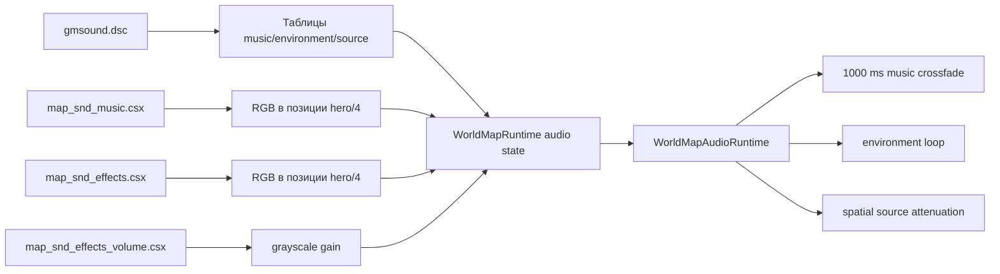

# Восстановление звука глобальной карты Golden Land 2

## Результат

В браузерной реализации восстановлена отдельная нативная звуковая система глобальной карты из `Client.dll`: региональная музыка, звуковое окружение, маска громкости, поддержка пространственных источников и жизненный цикл звуков при переходах. Дополнительно устранена ошибка перехода в случайную встречу, при которой UI обращался к уже уничтоженному `WorldMapRuntime`.

Область анализа: `E:/Games/zlato22/Client.dll`, поставляемые ресурсы глобальной карты и соответствующий браузерный runtime. Case scope: `C:/Users/serfe/.agents/skills/work/goldenland-deep-re/scope.md`.

## Воспроизведение проверки

```powershell
node tools/verify-world-map-runtime.mjs
npx tsc -b
npm run build
```

Браузерная проверка:

1. Запустить Vite.
2. Создать героя и закрыть начальный диалог.
3. Открыть «Глобальную карту».
4. Убедиться, что браузер запрашивает `/assets/music/gl01.ogg`.
5. Назначить дальний маршрут и дождаться случайной встречи.
6. Проверить отсутствие `pageerror` при закрытии карты и загрузке уровня встречи.

## Evidence

| ID | Наблюдение | Источник |
|---|---|---|
| E-001 | `Client.dll` содержит отдельные пути выбора музыки, окружения и пространственных источников глобальной карты | `tmp/client-disasm.txt`, `0x120B52FC..0x120B5AC0` |
| E-002 | Поставляемый `gmsound.dsc` содержит 3 музыкальных и 3 environment-записи; три звуковые маски имеют размер `400×300` | `public/assets/scripts/globalmap/soundmap/gmsound.dsc`, `tools/verify-world-map-runtime.mjs` |
| E-003 | При открытии карты браузер успешно запросил `/assets/music/gl01.ogg`; после исправления переход во встречу завершился без `pageerror` | браузерная сессия Vite |

Полные записи Evidence находятся в `C:/Users/serfe/.agents/skills/work/goldenland-deep-re/evidence/`.

## Findings

### F-001 — глобальная карта не использует уровень `SENV`

- category: `reverse_algo`
- status: `validated`
- confidence: high
- evidence_ids: `E-001`, `E-002`
- location: `Client.dll:0x120B541C..0x120B5AC0`

`Client.dll` загружает `scripts/globalmap/soundmap/gmsound.dsc` и три самостоятельные маски:

| Маска | Назначение |
|---|---|
| `map_snd_music.csx` | RGB региона → музыкальная запись |
| `map_snd_effects.csx` | RGB региона → environment loop |
| `map_snd_effects_volume.csx` | grayscale → громкость environment loop |

Следовательно, звук карты не должен наследовать ambient текущего уровня.

### F-002 — музыка переключается с нативным fade 1000 мс

- category: `reverse_algo`
- status: `validated`
- confidence: high
- evidence_ids: `E-001`
- location: `Client.dll:0x120B52FC..0x120B5417`

Координаты героя делятся на четыре, RGB пикселя ищется в таблице `music`, а при смене источника старый и новый треки переходят за `0x3e8 = 1000` мс.

### F-003 — окружение использует отдельную маску громкости

- category: `reverse_algo`
- status: `validated`
- confidence: high
- evidence_ids: `E-001`, `E-002`
- location: `Client.dll:0x120B58A0..0x120B5AC0`

Громкость вычисляется из grayscale-пикселя и настройки звука с нативным целочисленным квантованием процентов. Для необязательных записей `source x y path` действует радиус 50 пикселей карты:

```text
volumePercent = trunc((1 - distance / 50) * 100)
```

В поставляемом `gmsound.dsc` точечных `source`-записей нет, но клиентская функция полностью восстановлена.

### F-004 — переход во встречу имел browser-only race

- category: `design`
- status: `validated`
- confidence: high
- evidence_ids: `E-003`
- location: `src/game/Game.ts:updateWorldMap`

`WorldMapRuntime.update()` мог синхронно начать встречу и обнулить `Game.worldMap`. После возврата прежний код без повторной проверки вызывал `this.worldMap.getState()`, что давало:

```text
TypeError: Cannot read properties of null (reading 'getState')
```

Исправление удерживает локальную ссылку и публикует state только если активная карта всё ещё является тем же экземпляром.

## Path

### P-001 — путь выбора и воспроизведения звука карты



1. `Client.dll:0x120B541C` разбирает descriptor и создаёт три таблицы.
2. `0x120B52FC` выбирает музыкальный цвет и управляет переходом треков.
3. `0x120B58A0` выбирает environment, mask gain и точечные источники.
4. `NativeGlobalMapData.ts` загружает те же поставляемые данные.
5. `WorldMapRuntime.ts` вычисляет состояние в текущей точке.
6. `WorldMapAudioRuntime.ts` воспроизводит и освобождает принадлежащие карте треки.

## Изменённые файлы

- `src/game/NativeGlobalMapData.ts`
- `src/game/WorldMapRuntime.ts`
- `src/game/WorldMapAudioRuntime.ts`
- `src/game/Game.ts`
- `tools/verify-world-map-runtime.mjs`
- `docs/reverse-engineering.md`

## Проверка

- `node tools/verify-world-map-runtime.mjs` — пройдено; проверены shipped descriptor, выбор music/environment, native percent quantization, spatial radius, маршрутизация, встречи и переход `GM`.
- `npx tsc -b` — пройдено без диагностик.
- `npm run build` — пройдено: 722 модуля, production bundle создан. Осталось существующее предупреждение Vite о чанке больше 500 кБ.
- Браузер — `/assets/music/gl01.ogg` загружен при открытии карты; дальний маршрут завершился переходом в случайную встречу без `pageerror` после исправления lifecycle race.

## Ограничения инструментов

`zhaoxuya520/reverse-skill` был применён как управляющий workflow: создан scope, выбран `ida-reverse`, проверен tool-index и оформлена Evidence → Finding → Path цепочка. Локальный IDA MCP не запустился из-за отсутствующего `idalib-mcp`, а bootstrap `r2/rabin2` завершился внутренней ошибкой свойства `Count`. Поэтому статический анализ выполнен по существующему полному дизассемблированию `Client.dll`, а значения констант проверены непосредственно в PE через `pefile`.
