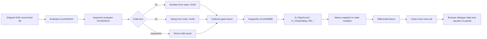

# Типизированные AGE-функции Golden Land 2

## Результат

Нативный x86 oracle теперь загружает произвольные диалоговые AGE-ассеты, захватывает числовые и строковые аргументы с исходными record-индексами и безопасно останавливает трассу через нативный exit-флаг. Восстановлены и дифференциально подтверждены `D_PlaySound`, `D_CloseDialog`, двухаргументный `RS_GetRandMinMaxI` и `RS_AddTime`; исправлены браузерные voice-пакеты и возвращаемое значение `RS_AddTime`.

Scope: `C:/Users/serfe/.agents/skills/work/goldenland-deep-re/scope.md` (`auth=granted`, `network_profile=lab_only`).

## Воспроизведение

```powershell
i686-w64-mingw32-clang++ tools/native-oracle/oracle.cpp `
  -std=c++17 -O2 -Wall -Wextra -municode -static `
  -o .tmp/native-oracle.exe -lbcrypt -lgdi32

.tmp/native-oracle.exe `
  --game-root E:/Games/zlato22 `
  --asset-root G:/ws/zlato2/public/assets `
  --host-facades --probe-config-object --initialize `
  --quiet-stubs --server-only --invoke-native-dialog `
  --native-dialog-asset l0.p228_nazgul.d228.age.cs `
  --native-dialog-function-limit 2

node tools/compare-age-function-traces.mjs `
  tools/nazgul-play-sound.native.ndjson `
  tools/nazgul-play-sound.clean-room.ndjson

node tools/compare-age-function-traces.mjs `
  tools/good-guard-close.native.ndjson `
  tools/good-guard-close.clean-room.ndjson

node tools/compare-age-function-traces.mjs `
  tools/add-time.native.ndjson `
  tools/add-time.clean-room.ndjson
```

Ожидаемые последовательности:

```text
D_Say(6127); D_PlaySound("Nazgul\\vot_my_i_vstretilis.ogg")
D_Say(1100); D_Answer(1103); RS_GetRandMinMaxI(1,4); D_CloseDialog(0)
D_Say(9704); D_Answer(568); RS_AddTime(25,0); D_CloseDialog(0)
```

## Evidence

| ID | Наблюдение | Источник |
|---|---|---|
| E-007 | Нативный kind `22` передал точную строку `Nazgul\\vot_my_i_vstretilis.ogg`; opcode-12 сохранил 26-байтовый basename без расширения | `tools/nazgul-play-sound.native.ndjson`, packet fixture |
| E-008 | Двухаргументный random и `D_CloseDialog(0)` совпали; нативный flow завершился с exit, clean-room — `endReason="closed"` | `tools/good-guard-close.*.ndjson` |
| E-009 | `RS_AddTime(25,0)` получил два числовых аргумента, вернул `0` и передал длительность в нативный time runtime | `Server.dll:0x14040F34`, `tools/add-time.*.ndjson` |
| E-010 | TypeScript, AGE/SCR corpora, host/packet verifiers, браузер и production build прошли | проектные проверки |

Полные записи: `C:/Users/serfe/.agents/skills/work/goldenland-deep-re/evidence/`.

## Findings

### F-008 — AGE-аргументы имеют сохраняемый runtime-тип

- severity: `n/a_re`
- category: `reverse_algo`
- status: `validated`
- evidence_ids: `E-007`, `E-008`, `E-009`
- confidence: high
- location: `Server.dll+0x3A010`, `Server.dll+0x3A914`
- remediation: n/a

Kind `24` хранит число в node `+0x40`. Kind `22` хранит строку в node `+0x48`; её необходимо копировать до завершения родительского function evaluation, потому что нативное runtime-дерево может быть изменено обработчиком. Для каждого аргумента oracle сохраняет фактический порядок и record из слотов function node `+0x18..+0x3C`.

### F-009 — `D_PlaySound` публикует basename без расширения

- severity: `n/a_re`
- category: `reverse_algo`
- status: `validated`
- evidence_ids: `E-007`, `E-010`
- confidence: high
- location: `Server.dll:0x1403FCEC`, voice setter `0x1404345C`
- remediation: n/a

AGE вызывает `D_PlaySound` с полным относительным именем `.ogg`. Серверный snapshot записывает в voice-tail только basename без расширения. Для `Nazgul\\vot_my_i_vstretilis.ogg` длина tail равна 26 байтам. `DialogueState.voiceBasename` и браузерный opcode-12 encoder теперь воспроизводят этот контракт.

### F-010 — `D_CloseDialog` является явным завершением

- severity: `n/a_re`
- category: `reverse_algo`
- status: `validated`
- evidence_ids: `E-008`
- confidence: high
- location: `Server.dll:0x1403FC60`, `inter_good_guard2.age.cs` record 107
- remediation: n/a

После `D_CloseDialog(0)` нативный flow node имеет `exit=true`, а dialogue context закрывается. Clean-room runtime завершает тот же префикс с `endReason="closed"`. Это отделяет явное закрытие от обычного опубликования очередной реплики; различие с `Exit` и исчерпанием графа ещё требует отдельных нативных срезов.

### F-011 — `RS_AddTime` возвращает ноль

- severity: `n/a_re`
- category: `reverse_algo`
- status: `validated`
- evidence_ids: `E-009`, `E-010`
- confidence: high
- location: `Server.dll:0x14040F34..0x14040FAD`, `src/game/GameStateRuntime.ts`
- remediation: n/a

Нативный обработчик принимает `(hours, minutes)`, вычисляет `days = hours / 24`, `remainingHours = hours % 24`, записывает минуты в поле длительности и вызывает `Server.dll+0x5B504`. Независимо от успешного пути обработчик загружает `float64 0.0`. Браузер уже правильно прибавлял время, но возвращал `1`; теперь `RS_AddTime(25,0)` прибавляет 1500 минут и возвращает `0`.

## Path

### P-003 — типизированный вызов от AGE до браузерного пакета



1. Oracle загружает выбранный shipped AGE через `--native-dialog-asset`.
2. Рекурсивный evaluator собирает тип, record и значение каждого непосредственного аргумента.
3. `--native-dialog-function-limit` выставляет нативный exit-флаг после заданного префикса, не подменяя возврат функции.
4. Comparator проверяет ID, слот, имя, record, аргументы и результат.
5. Подтверждённое расхождение исправляется в clean-room runtime и проверяется в реальном браузерном модуле.

## Изменения

- `tools/native-oracle/oracle.cpp`
  - произвольный `--native-dialog-asset`;
  - динамическая регистрация kind-23 variables;
  - `--native-dialog-function-limit`;
  - typed string/number arguments и `argumentRecords`;
  - реестр 43 найденных функций.
- `tools/trace-age-dialogue.mjs`
  - clean-room AGE trace, reply selection, deterministic host results и function limit.
- `tools/compare-age-function-traces.mjs`
  - prefix differential для функций.
- `src/game/dialogue/DialogueRuntime.ts`
  - `voiceBasename`, семантика `D_PlaySound`, сброс на `D_Say`.
- `src/game/Game.ts`
  - кодирование voice-tail в snapshot-пакете.
- `src/game/GameStateRuntime.ts`
  - native-zero return для `RS_AddTime`.
- `tools/verify-dialogue-packets.mjs`
  - нативная voice-фикстура.
- `tools/verify-native-scr-hosts.mjs`
  - контракт `RS_AddTime(25,0)`: delta 1500, return 0.
- `tools/nazgul-play-sound.*.ndjson`
- `tools/good-guard-close.*.ndjson`
- `tools/add-time.*.ndjson`

## Проверка

- Полный демон-дифференциал: 147 evaluations, 84 flow nodes, 6 functions, 3 packets, 2 turns.
- PlaySound prefix: 2/2 функций совпали.
- Close/random prefix: 4/4 функций совпали.
- AddTime prefix: 4/4 функций совпали.
- Dialogue packet verifier: 3 opcode-12 packets, opcode-6 reply и обе tail-области.
- AGE corpus: 556/556.
- SCR corpus: 571 файлов, 1792 handlers, 1380 statements, failures `[]`.
- Browser PlaySound: `voiceBasename="Nazgul\\vot_my_i_vstretilis"`, phrase 6127, pageerror `[]`.
- Browser AddTime: before 372, after 1872, delta 1500, return 0, pageerror `[]`.
- TypeScript и production build: успешно; 722 модуля, только существующее предупреждение Vite о размере чанка.

## Оставшаяся граница

Следующие executable-first срезы:

- `Exit` против graph exhaustion и context destruction;
- function ID `0` в семи shipped AGE-файлах;
- string-return функции и mixed string/numeric operators;
- высокоаргументные мутации `RS_AddPerson_2` (8), `RS_AddPerson_1` (5), `RS_PersonTransferItemI` (4);
- ownership и persistence AGE variables между dialogue, scenario, save/load.

Timeline: `C:/Users/serfe/.agents/skills/work/goldenland-deep-re/timeline.md`.
